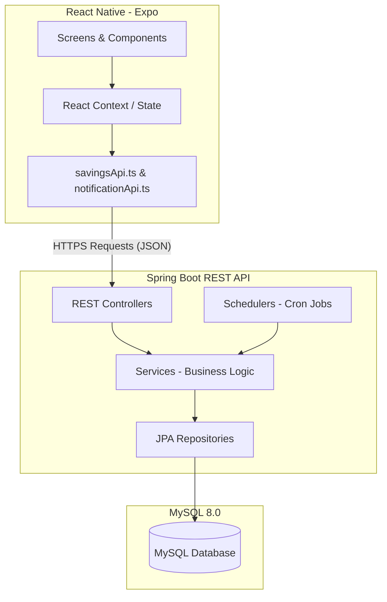

# BÁO CÁO KỸ THUẬT - MODULE CÁ NHÂN (BUDGET, GOAL, NOTIFICATION)
**Dự án:** Finma - Ứng dụng quản lý tài chính cá nhân
**Nhóm thực hiện:** Nhóm 09 - PTIT
**Thành viên thực hiện phần cá nhân:** [Tên của bạn]

---

## 1. PHẦN TÀI LIỆU KỸ THUẬT MÔ TẢ CHỨC NĂNG

### 1.1. Danh sách chức năng được phân công
Module cá nhân phụ trách ba cấu phần cốt lõi nhằm giúp người dùng quản lý chi tiêu và tích lũy hiệu quả:
1. **Ngân sách (Budget):**
   * **Thiết lập ngân sách:** Cho phép người dùng tạo hạn mức chi tiêu cho từng danh mục chi tiêu cụ thể (ăn uống, mua sắm, di chuyển,...) theo các kỳ hạn khác nhau.
   * **Theo dõi & Giám sát chi tiêu:** Tự động tính toán tổng số tiền đã chi tiêu trong kỳ hạn ngân sách, số tiền còn lại và tỷ lệ phần trăm đã sử dụng.
   * **Cảnh báo thông minh:** Đưa ra cảnh báo nguy cơ vượt hạn mức khi chi tiêu chạm ngưỡng 80% và cảnh báo vượt mức khi chi tiêu đạt 100% trở lên.
   * **Tự động gia hạn (Recurring):** Tự động tạo lại các ngân sách được cấu hình lặp lại vào ngày đầu tiên của mỗi tháng tiếp theo với cùng hạn mức cũ.
2. **Mục tiêu tiết kiệm (Goal):**
   * **Thiết lập mục tiêu:** Tạo mục tiêu tài chính cụ thể (mua laptop, mua xe, quỹ dự phòng,...) với số tiền đích, ngày bắt đầu và hạn chót cần hoàn thành.
   * **Ghi nhận tích lũy (Deposit):** Cho phép nạp tiền tiết kiệm vào các mục tiêu từ tài khoản nguồn, tự động trừ số dư tài khoản tương ứng.
   * **Theo dõi tiến độ:** Tính toán thời gian còn lại (số ngày), số tiền còn thiếu, phần trăm tiến độ đã hoàn thành và ước tính số tiền cần tiết kiệm hàng ngày/hàng tháng để đạt mục tiêu đúng hạn.
   * **Cập nhật trạng thái tự động:** Khi số tiền tích lũy đạt hoặc vượt mức đích, trạng thái mục tiêu tự động chuyển sang `COMPLETED`. Ngược lại, nếu người dùng xóa/hoàn tác giao dịch nạp tiền dẫn đến tổng số tích lũy nhỏ hơn mức đích, trạng thái sẽ tự động chuyển ngược về `IN_PROGRESS`.
3. **Thông báo (Notification - Noti):**
   * **Thông báo tự động từ hệ thống:** 
     * Gửi cảnh báo khi ngân sách đạt 80% (`BUDGET_WARNING`) hoặc vượt hạn mức (`BUDGET_EXCEEDED`).
     * Nhắc nhở nạp tiền định kỳ cho mục tiêu và cảnh báo mục tiêu sắp đến hạn chót dưới 7 ngày (`GOAL_DEADLINE_NEAR`).
     * Lời chúc buổi sáng (`DAILY_GREETING`) và nhắc nhở nhập giao dịch chi tiêu cuối ngày lúc 20:00 nếu chưa ghi nhận giao dịch nào (`DAILY_REMINDER`).
     * Nhắc nhở khoản nợ sắp đến hạn thanh toán dưới 7 ngày (`DEBT_REMINDER`).
   * **Quản lý trạng thái thông báo:** Hỗ trợ người dùng xem danh sách thông báo (phân nhóm theo Hôm nay, Hôm qua, Cũ hơn), đánh dấu một hoặc tất cả thông báo là đã đọc, xóa một hoặc xóa toàn bộ thông báo đã đọc.

---

### 1.2. Kiến trúc chi tiết hệ thống
Hệ thống được phát triển theo mô hình **Client-Server** với kiến trúc phân lớp rõ ràng.

#### 1.2.1. Sơ đồ kiến trúc tổng thể (Architecture Diagram)


#### 1.2.2. Các thành phần chính và cơ chế kết nối
* **Tầng Controller:** Tiếp nhận các HTTP Request (GET, POST, PUT, DELETE, PATCH) từ React Native client qua giao thức REST API, kiểm tra tính hợp lệ của dữ liệu đầu vào (Validation) và gọi Service tương ứng.
* **Tầng Service:** Chứa logic nghiệp vụ cốt lõi của ứng dụng. `BudgetService` và `GoalService` thực hiện tính toán chi tiêu và tích lũy. Khi có các sự kiện thay đổi trạng thái (vượt ngân sách, hoàn thành mục tiêu), các Service này sẽ gọi đến `NotificationService` để lưu trữ thông báo tương ứng vào cơ sở dữ liệu.
* **Tầng Repository:** Sử dụng Spring Data JPA để tự động sinh các câu lệnh SQL tương tác với hệ quản trị cơ sở dữ liệu MySQL, giúp thực hiện các thao tác CRUD và các câu truy vấn thống kê phức tạp một cách nhanh chóng.
* **Tầng Scheduler:** Đảm nhiệm các tác vụ chạy ngầm định kỳ bằng cách sử dụng `@Scheduled` của Spring Boot:
  * `BudgetScheduler` chạy lúc 00:00 ngày 1 hàng tháng để sinh lại các ngân sách lặp lại.
  * `NotificationScheduler` chạy lúc 08:00 và 20:00 hàng ngày để gửi các nhắc nhở hạn chót và nhập giao dịch.

---

### 1.3. Code đáp ứng chức năng

#### 1.3.1. Các bảng dữ liệu trong Cơ sở dữ liệu (Database Schema)
Các bảng liên quan trực tiếp đến phân hệ này trong MySQL gồm:

1. **Bảng `budgets` (Ngân sách):**
   * `id` (BIGINT, Primary Key, Auto Increment)
   * `amount_limit` (DECIMAL(38,2)): Hạn mức tiền tối đa thiết lập cho ngân sách.
   * `period_type` (VARCHAR(255)): Kỳ hạn áp dụng ngân sách (WEEKLY, MONTHLY, YEARLY,...).
   * `start_date` (DATE): Ngày bắt đầu tính ngân sách.
   * `end_date` (DATE): Ngày kết thúc tính ngân sách.
   * `is_recurring` (BIT): Đánh dấu có tự động gia hạn khi kết thúc kỳ hay không.
   * `parent_budget_id` (BIGINT): ID của ngân sách gốc ban đầu (dùng để truy vết lịch sử).
   * `category_id` (BIGINT, Foreign Key): Danh mục chi tiêu liên kết với ngân sách.
   * `user_id` (BIGINT, Foreign Key): ID người dùng sở hữu ngân sách.
   * `created_at` (DATETIME), `updated_at` (DATETIME): Thời điểm tạo và cập nhật.

2. **Bảng `goals` (Mục tiêu tiết kiệm):**
   * `id` (BIGINT, Primary Key, Auto Increment)
   * `name` (VARCHAR(255)): Tên mục tiêu tiết kiệm.
   * `description` (VARCHAR(255)): Mô tả chi tiết.
   * `target_amount` (DECIMAL(38,2)): Số tiền đích cần tích lũy.
   * `start_date` (DATE): Ngày bắt đầu thực hiện mục tiêu.
   * `end_date` (DATE): Hạn chót cần đạt được mục tiêu.
   * `completed_at` (DATE): Ngày thực tế hoàn thành mục tiêu (nếu có).
   * `status` (VARCHAR(255)): Trạng thái mục tiêu (`IN_PROGRESS`, `COMPLETED`, `CANCELLED`).
   * `icon` (VARCHAR(255)): Tên biểu tượng hiển thị.
   * `color` (VARCHAR(255)): Mã màu sắc hiển thị trên UI.
   * `user_id` (BIGINT, Foreign Key): ID người dùng sở hữu mục tiêu.

3. **Bảng `notifications` (Thông báo):**
   * `id` (BIGINT, Primary Key, Auto Increment)
   * `title` (VARCHAR(255)): Tiêu đề thông báo.
   * `content` (TEXT): Nội dung thông báo chi tiết.
   * `type` (VARCHAR(50)): Loại thông báo (`BUDGET_WARNING`, `BUDGET_EXCEEDED`, `GOAL_COMPLETED`, `GOAL_DEPOSIT_ADDED`, `GOAL_DEADLINE_NEAR`, `DEBT_REMINDER`, `DAILY_REMINDER`, `DAILY_GREETING`).
   * `reference_id` (BIGINT): ID của đối tượng liên quan (ID ngân sách hoặc mục tiêu).
   * `reference_type` (VARCHAR(50)): Tên đối tượng liên quan (`BUDGET` hoặc `GOAL`).
   * `is_read` (BIT): Trạng thái đã đọc hay chưa.
   * `user_id` (BIGINT, Foreign Key): ID người dùng nhận thông báo.

---

#### 1.3.2. Danh sách các Lớp & Hàm chính (Backend)

##### 1. Quản lý Ngân sách (Budget)
* **`BudgetController`:**
  * `getAvailableCategories()`: Lấy các danh mục thuộc loại `EXPENSE` để thiết lập ngân sách.
  * `createBudget(BudgetRequest)`: Nhận yêu cầu tạo ngân sách mới.
  * `getAllBudgets()`: Lấy danh sách toàn bộ ngân sách của người dùng.
  * `getActiveBudgets()`: Lấy các ngân sách đang trong thời gian có hiệu lực.
  * `getBudget(id)`: Lấy chi tiết ngân sách theo ID.
  * `updateBudget(id, BudgetRequest)`: Cập nhật hạn mức, ngày hoặc danh mục ngân sách.
  * `deleteBudget(id)`: Xóa ngân sách.
* **`BudgetService`:**
  * `mapToResponse(Budget, userId)`: Hàm chuyển đổi entity sang DTO, đồng thời tính toán số tiền đã dùng từ bảng giao dịch (`transactionRepository.sumExpenseByCategoryAndPeriod`), tỷ lệ %, xác định trạng thái ngân sách (`SAFE`, `WARNING`, `EXCEEDED`) và tự động tạo thông báo cảnh báo qua `NotificationService`.
  * `createBudget(BudgetRequest)`: Triển khai logic tạo ngân sách, tự động tính ngày bắt đầu/kết thúc nếu chọn lặp lại và kiểm tra trùng lặp thời gian (`existsOverlappingBudget`).
* **`BudgetRepository`:**
  * `existsOverlappingBudget(...)`: Query kiểm tra chồng chéo khoảng thời gian ngân sách.
  * `findActiveBudgetsByUser(...)`: Lấy các ngân sách đang hoạt động của user.
  * `findAllRecurringRootBudgets()`: Lấy tất cả ngân sách lặp lại gốc để tự động sinh kỳ mới.
* **`BudgetScheduler`:**
  * `autoGenerateMonthlyBudgets()`: Cron job chạy lúc 00:00 ngày 1 hàng tháng để quét và sinh tự động ngân sách kỳ hạn mới cho các ngân sách có cờ lặp lại.

##### 2. Quản lý Mục tiêu tiết kiệm (Goal)
* **`GoalController`:**
  * `createGoal(GoalRequest)`: Tạo mục tiêu tiết kiệm.
  * `getAllGoals()`: Lấy danh sách toàn bộ mục tiêu.
  * `getGoal(id)`: Lấy chi tiết mục tiêu (bao gồm tiến độ và kế hoạch cần tích lũy).
  * `updateGoal(id, GoalRequest)`: Sửa đổi mục tiêu.
  * `cancelGoal(id)`: Hủy thực hiện mục tiêu.
  * `deleteGoal(id)`: Xóa mục tiêu và tất cả giao dịch nạp tiền liên quan.
  * `addDeposit(GoalDepositRequest)`: Thực hiện nạp tiền tiết kiệm vào mục tiêu.
  * `getDeposits(goalId)`: Lấy lịch sử nạp tiền vào mục tiêu này.
  * `deleteDeposit(depositId)`: Xóa (hoàn tác) giao dịch nạp tiền.
* **`GoalService`:**
  * `queryCurrentAmount(goalId)`: Tính tổng số tiền đã tích lũy thực tế bằng truy vấn `SUM` giao dịch có type là `SAVING` ứng với ID mục tiêu.
  * `mapToResponse(Goal)`: Chuyển đổi entity Goal sang DTO, tính toán số ngày còn lại, tính số tiền thiếu, tính % tiến độ và dự tính số tiền cần tích lũy mỗi ngày/mỗi tháng.
  * `addDeposit(GoalDepositRequest)`: Tạo giao dịch loại `SAVING`, cập nhật giảm số dư của tài khoản thanh toán được chọn, kiểm tra nếu tổng tiền tiết kiệm đạt đích thì tự động chuyển trạng thái mục tiêu sang `COMPLETED` và gửi thông báo chúc mừng.
  * `deleteDeposit(transactionId)`: Xóa giao dịch tích lũy, hoàn trả tiền lại tài khoản nguồn, kiểm tra lại số tiền còn lại của mục tiêu, nếu giảm dưới hạn mức đích thì chuyển trạng thái từ `COMPLETED` về `IN_PROGRESS`.

##### 3. Quản lý Thông báo (Notification)
* **`NotificationController`:**
  * `getAll()`: Lấy tất cả thông báo của người dùng.
  * `getUnread()`: Lấy thông báo chưa đọc.
  * `countUnread()`: Đếm số lượng chưa đọc hiển thị lên biểu tượng chuông báo.
  * `markAsRead(id)`: Đánh dấu một thông báo là đã đọc.
  * `markAllAsRead()`: Đánh dấu đọc tất cả.
  * `delete(id)`: Xóa một thông báo.
  * `deleteAllRead()`: Dọn dẹp tất cả thông báo đã đọc.
* **`NotificationService`:**
  * `createNotification(user, type, title, content, refId, refType)`: Tạo thông báo mới. Hỗ trợ cơ chế chống spam (không tạo thông báo trùng loại cho cùng đối tượng liên kết trong một khoảng thời gian).
  * `hasReceivedTypeToday(userId, type)`: Kiểm tra xem hôm nay người dùng đã nhận loại thông báo này chưa (dùng để tránh gửi nhiều lời chào hoặc nhắc nhở nhập giao dịch trong ngày).
* **`NotificationScheduler`:**
  * `checkGoalDeadlines()`: Quét hàng ngày lúc 08:00 sáng, gửi thông báo `GOAL_DEADLINE_NEAR` nếu mục tiêu chưa hoàn thành còn dưới 7 ngày.
  * `checkDebtDeadlines()`: Quét hàng ngày lúc 08:30 sáng để gửi nhắc nhở các khoản vay/cho vay sắp đến hạn.
  * `sendDailyEntryReminder()`: Kiểm tra hàng ngày lúc 20:00 tối, gửi nhắc nhở nhập giao dịch nếu trong ngày hôm nay người dùng chưa thêm giao dịch chi tiêu/thu nhập nào.
  * `sendDailyGreeting()`: Gửi lời chào buổi sáng kèm lời chúc lúc 07:00 sáng hàng ngày.

---

#### 1.3.3. Các API gọi ngoài (External APIs)
Trong module cá nhân này, hệ thống chủ yếu giao tiếp nội bộ qua các API của hệ thống tự xây dựng. Tuy nhiên, hệ thống có liên kết đến dịch vụ **Email SMTP Service** (`EmailService`) để gửi các thông báo đặc biệt hoặc mã OTP khôi phục tài khoản, và sử dụng **Google Gemini AI API** (`GeminiService`) tại các mô-đun phân tích tài chính/chat tư vấn để đưa ra lời khuyên tài chính cá nhân dựa trên dữ liệu ngân sách và mục tiêu của người dùng.

---

### 1.4. Hướng dẫn và Các lưu ý khi cài đặt, triển khai

#### 1.4.1. Hướng dẫn cài đặt Backend (Spring Boot)
1. **Yêu cầu môi trường:**
   * Java Development Kit (JDK) 17 hoặc cao hơn.
   * Apache Maven 3.8+ hoặc sử dụng Maven Wrapper (`mvnw` đi kèm).
   * Hệ quản trị cơ sở dữ liệu MySQL 8.0+.
2. **Cấu hình Cơ sở dữ liệu:**
   * Tạo cơ sở dữ liệu trong MySQL:
     ```sql
     CREATE DATABASE finance_app CHARACTER SET utf8mb4 COLLATE utf8mb4_unicode_ci;
     ```
   * Chạy tập lệnh SQL mẫu để khởi tạo bảng và chèn dữ liệu thử nghiệm: Chạy file `seed_data .sql` có sẵn tại thư mục gốc của dự án.
3. **Cấu hình ứng dụng:**
   * Mở file `Finma_BE/Finma_BE/src/main/resources/application.properties` (hoặc `.yml` tùy cấu hình) và điều chỉnh thông tin kết nối MySQL:
     ```properties
     spring.datasource.url=jdbc:mysql://localhost:3306/finance_app?useSSL=false&serverTimezone=Asia/Ho_Chi_Minh&allowPublicKeyRetrieval=true
     spring.datasource.username=YOUR_MYSQL_USERNAME
     spring.datasource.password=YOUR_MYSQL_PASSWORD
     ```
4. **Khởi chạy Backend:**
   * Di chuyển vào thư mục `Finma_BE/Finma_BE/` và thực thi các lệnh:
     ```bash
     ./mvnw clean install
     ./mvnw spring-boot:run
     ```
   * Server sẽ khởi chạy mặc định tại cổng `8080`. Địa chỉ API cơ sở: `http://localhost:8080/`.

#### 1.4.2. Hướng dẫn cài đặt Frontend (React Native - Expo)
1. **Yêu cầu môi trường:**
   * Node.js phiên bản LTS (v18 hoặc v20 khuyến nghị).
   * npm hoặc yarn installed.
   * Ứng dụng **Expo Go** trên thiết bị di động (iOS/Android) hoặc trình giả lập được thiết lập sẵn.
2. **Cài đặt dependencies:**
   * Di chuyển vào thư mục `Finma_FE/` và chạy lệnh:
     ```bash
     npm install
     ```
3. **Cấu hình địa chỉ API:**
   * Thiết lập địa chỉ IP của máy chủ chạy backend trong cấu hình HTTP Client của frontend (thay đổi `localhost` thành IP nội bộ của máy tính trong mạng LAN nếu chạy test trên thiết bị thật qua Expo Go).
4. **Khởi chạy ứng dụng:**
   * Chạy lệnh khởi động Expo:
     ```bash
     npx expo start
     ```
   * Quét mã QR hiển thị trên màn hình terminal bằng ứng dụng Expo Go (trên Android) hoặc ứng dụng Camera (trên iOS) để tải ứng dụng.

#### 1.4.3. Các lưu ý quan trọng khi cài đặt & triển khai
* **Timezone (Múi giờ):** Cần đảm bảo múi giờ cấu hình trên cả Database và JVM là `Asia/Ho_Chi_Minh` để các tác vụ lập lịch thông báo (`NotificationScheduler`) và tạo lại ngân sách (`BudgetScheduler`) chạy đúng vào thời điểm mong muốn thực tế (ví dụ: nhắc nhở lúc 20:00 tối).
* **Bảo mật API:** Các API yêu cầu phải truyền mã JWT Token trong Header (`Authorization: Bearer <token>`) ngoại trừ các API đăng ký/đăng nhập.
* **Cơ chế nạp tiền tiết kiệm:** Việc xóa hoặc hoàn tác giao dịch tiết kiệm sẽ ảnh hưởng trực tiếp đến trạng thái của `Goal` nên cần đảm bảo tính toàn vẹn dữ liệu (Transaction) trong các phương thức của `GoalService` bằng annotation `@Transactional`.

---

## 2. PHẦN CODE VÀ DANH SÁCH FILE LIÊN QUAN

### 2.1. Danh sách các file liên quan đến Module Cá nhân
Các file code chính cấu thành nên phân hệ cá nhân này bao gồm:

#### 2.1.1. Backend (Spring Boot)
1. **Entities & DTOs:**
   * [Budget.java](file:///d:/Finma/Finma_BE/Finma_BE/src/main/java/com/example/Finma_BE/entity/Budget.java) - Định nghĩa thực thể ngân sách.
   * [Goal.java](file:///d:/Finma/Finma_BE/Finma_BE/src/main/java/com/example/Finma_BE/entity/Goal.java) - Định nghĩa thực thể mục tiêu tiết kiệm.
   * [Notification.java](file:///d:/Finma/Finma_BE/Finma_BE/src/main/java/com/example/Finma_BE/entity/Notification.java) - Định nghĩa thực thể thông báo.
2. **Repositories:**
   * [BudgetRepository.java](file:///d:/Finma/Finma_BE/Finma_BE/src/main/java/com/example/Finma_BE/repository/BudgetRepository.java) - JPA Repository cho ngân sách.
   * [GoalRepository.java](file:///d:/Finma/Finma_BE/Finma_BE/src/main/java/com/example/Finma_BE/repository/GoalRepository.java) - JPA Repository cho mục tiêu.
   * [NotificationRepository.java](file:///d:/Finma/Finma_BE/Finma_BE/src/main/java/com/example/Finma_BE/repository/NotificationRepository.java) - JPA Repository cho thông báo.
3. **Services:**
   * [BudgetService.java](file:///d:/Finma/Finma_BE/Finma_BE/src/main/java/com/example/Finma_BE/service/BudgetService.java) - Logic nghiệp vụ xử lý ngân sách & tính % cảnh báo.
   * [GoalService.java](file:///d:/Finma/Finma_BE/Finma_BE/src/main/java/com/example/Finma_BE/service/GoalService.java) - Logic nghiệp vụ xử lý mục tiêu, nạp tiền tích lũy và chuyển đổi trạng thái.
   * [NotificationService.java](file:///d:/Finma/Finma_BE/Finma_BE/src/main/java/com/example/Finma_BE/service/NotificationService.java) - Xử lý gửi thông báo và quản lý trạng thái đã đọc/xóa.
4. **Controllers:**
   * [BudgetController.java](file:///d:/Finma/Finma_BE/Finma_BE/src/main/java/com/example/Finma_BE/controller/BudgetController.java) - REST endpoints cho ngân sách.
   * [GoalController.java](file:///d:/Finma/Finma_BE/Finma_BE/src/main/java/com/example/Finma_BE/controller/GoalController.java) - REST endpoints cho mục tiêu tiết kiệm.
   * [NotificationController.java](file:///d:/Finma/Finma_BE/Finma_BE/src/main/java/com/example/Finma_BE/controller/NotificationController.java) - REST endpoints cho thông báo.
5. **Schedulers:**
   * [BudgetScheduler.java](file:///d:/Finma/Finma_BE/Finma_BE/src/main/java/com/example/Finma_BE/util/BudgetScheduler.java) - Tiến trình tự động sinh lại ngân sách hàng tháng.
   * [NotificationScheduler.java](file:///d:/Finma/Finma_BE/Finma_BE/src/main/java/com/example/Finma_BE/util/NotificationScheduler.java) - Tiến trình gửi nhắc nhở định kỳ.

#### 2.1.2. Frontend (React Native - Expo)
1. **API Clients:**
   * [savingsApi.ts](file:///d:/Finma/Finma_FE/src/api/savingsApi.ts) - Gọi API của mục tiêu tiết kiệm và các giao dịch nạp tiền.
   * [notificationApi.ts](file:///d:/Finma/Finma_FE/src/api/notificationApi.ts) - Gọi API liên quan đến thông báo.
2. **Màn hình giao diện (Screens):**
   * [BudgetScreen.tsx](file:///d:/Finma/Finma_FE/src/screens/budget/BudgetScreen.tsx) - Giao diện chính theo dõi hạn mức ngân sách.
   * [BudgetDetailScreen.tsx](file:///d:/Finma/Finma_FE/src/screens/budget/BudgetDetailScreen.tsx) - Xem chi tiết tiến trình tiêu dùng của ngân sách.
   * [BudgetCreateScreen.tsx](file:///d:/Finma/Finma_FE/src/screens/budget/BudgetCreateScreen.tsx) - Thiết lập ngân sách mới.
   * [SavingsScreen.tsx](file:///d:/Finma/Finma_FE/src/screens/category/SavingsScreen.tsx) - Giao diện quản lý các mục tiêu tiết kiệm và tiến độ tích lũy.
   * [SavingTransactionDetailScreen.tsx](file:///d:/Finma/Finma_FE/src/screens/category/SavingTransactionDetailScreen.tsx) - Chi tiết lịch sử giao dịch tích lũy của mục tiêu.
   * [NotificationScreen.tsx](file:///d:/Finma/Finma_FE/src/screens/home/NotificationScreen.tsx) - Hộp thư thông báo của người dùng.

### 2.2. Điểm tối ưu đã thực hiện trong code
1. **Tối ưu hóa Truy vấn Lịch sử Nạp Tiền (Tránh lỗi N+1):**
   Trong `GoalService.getDeposits(Long goalId)`, thay vì thực hiện tính toán số tiền tích lũy hiện tại lặp đi lặp lại cho từng giao dịch nạp tiền trong danh sách phản hồi, hệ thống đã tối ưu bằng cách truy vấn tổng số tiền tích lũy hiện tại `queryCurrentAmount(goalId)` một lần duy nhất trước vòng lặp map và sử dụng lại giá trị này, cải thiện đáng kể tốc độ phản hồi khi số lượng giao dịch nạp tiền lớn.
2. **Cơ chế chống spam thông báo:**
   Trong `NotificationService.createNotification`, hệ thống kiểm tra sự tồn tại của thông báo cùng loại cho thực thể liên quan (`existsByUserIdAndTypeAndReferenceId`) trước khi lưu nhằm ngăn chặn việc gửi lặp liên tiếp các thông báo cảnh báo ngân sách hoặc nạp tiền trong thời gian ngắn.
3. **Ràng buộc giao dịch cơ sở dữ liệu (`@Transactional`):**
   Các tác vụ thay đổi đồng thời nhiều bảng như thêm giao dịch nạp tiền tiết kiệm (tạo bản ghi giao dịch, trừ số dư tài khoản nguồn, cập nhật trạng thái mục tiêu tiết kiệm, và tạo thông báo) đều được đưa vào trong các phương thức đánh dấu `@Transactional` để đảm bảo tính nhất quán (Atomicity), tránh việc mất mát hoặc sai lệch dữ liệu tài khoản nếu xảy ra lỗi giữa chừng.
4. **Nhận diện tự động múi giờ và thời gian (Local & UTC):**
   Cải tiến việc parse ngày giờ giao dịch trong `TransactionService.parseTransactionDate` hỗ trợ linh hoạt cả định dạng chuẩn ISO Offset DateTime có múi giờ của di động gửi lên lẫn định dạng chuỗi thông thường, giúp hệ thống không bị lệch ngày giao dịch do chênh lệch múi giờ.
